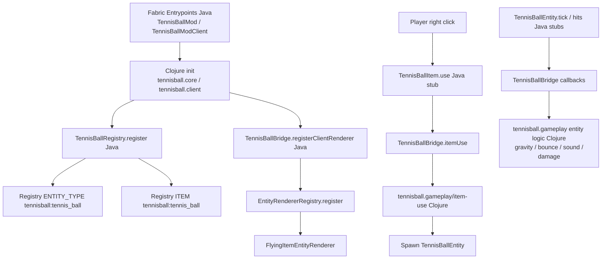

# Tennis Ball Mod

A Minecraft Fabric mod that adds a throwable tennis ball item, written in Clojure!

## Features

- **Tennis Ball Item**: A throwable projectile you can use
- **Realistic Bouncing**: The tennis ball bounces off blocks with physics
- **Sound Effects**: Throwing and bouncing sounds
- **Particle Effects**: Visual feedback when the ball bounces
- **Stack Size**: Hold up to 16 tennis balls

## Requirements

- Minecraft Java Edition 1.21.4
- Fabric Loader 0.16.9+
- Fabric API
- Java 17+

## Building

To build the mod:

```bash
./gradlew build
```

The compiled mod JAR will be in `build/libs/`

## Development

This mod is primarily written in Clojure with minimal Java bootstrap code. The implementation includes:

- `src/main/clojure/tennisball/core.clj` - Main mod initialization
- `src/main/clojure/tennisball/client.clj` - Client initialization
- `src/main/clojure/tennisball/gameplay.clj` - Item use and tennis-ball physics logic
- `src/main/java/com/tennisball/TennisBallMod.java` - Minimal Java entry point
- `src/main/java/com/tennisball/TennisBallBridge.java` - Java↔Clojure bridge for gameplay callbacks

## Architecture (Bridge + Renderer)



## Running in Development

1. Import the project in your IDE
2. Run the Minecraft client task:
   ```bash
   ./gradlew runClient
   ```
    2a. Optionally build with
    ```bash
    ./gradlew build
    ```

## Usage in Game

1. Find the Tennis Ball in the Tools creative tab
    
    `/give @p tennisball:tennis_ball` or `/give @p tennisball:tennis_ball_explosive`
2. Right-click to throw it
3. Watch it bounce realistically!
4. The ball will disappear after losing momentum

## Technical Details

- Uses Fabric's lightweight modding API
- Clojure interop with Minecraft's Java API
- Custom projectile entity with bounce physics
- Java stubs delegate gameplay behavior to Clojure via bridge calls
